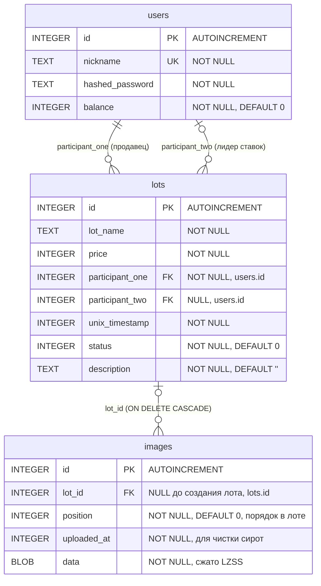

# бэкенд для «аукциона»

## Функционал
- Поддержка создания лотов
- Торги с повышением цены
- Транзакционное сохранение данных в SQLite
- Увеличение баланса пользователя
- Продажа лотов с отображением в «личном кабинете»
- Загрузка и отдача картинок лотов (PNG / JPEG / GIF / WebP), без ограничения количества картинок на лот

## Особенности

### База данных

Хранилище — **SQLite** (через биндинг [`d2sqlite3`](https://github.com/Abscissa/d2sqlite3)). Все данные пишутся сразу при изменении, отдельного «flush» не требуется. Схема создаётся автоматически при первом старте в файле `data/db/lottery.sqlite`. При открытии включаются `foreign_keys = ON`, `journal_mode = WAL` и `busy_timeout = 5000`.

Таблицы:

```sql
users(id, nickname UNIQUE, hashed_password, balance)
lots(id, lot_name, price, participant_one, participant_two NULL,
     unix_timestamp, status, description)
images(id, lot_id NULL, position, uploaded_at, data BLOB)
```

Картинка принадлежит **ровно одному лоту**: связь хранится прямо в `images.lot_id` (внешний ключ на `lots.id` с `ON DELETE CASCADE`). Отдельной таблицы связей нет. Пока лот ещё не создан (фото загружается раньше вызова `/lotRegister`), `lot_id = NULL`.

```sql
CREATE TABLE images (
    id INTEGER PRIMARY KEY AUTOINCREMENT,
    lot_id INTEGER,                                   -- NULL до привязки к лоту
    position INTEGER NOT NULL DEFAULT 0,              -- порядок фото внутри лота
    uploaded_at INTEGER NOT NULL DEFAULT (strftime('%s', 'now')),
    data BLOB NOT NULL,                               -- сжато LZSS
    FOREIGN KEY (lot_id) REFERENCES lots(id) ON DELETE CASCADE
);
CREATE INDEX idx_images_lot ON images(lot_id, position);
```

Лоты пользователя (для личного кабинета и счётчика сделок) определяются запросом по `lots`: лот относится к пользователю, если он его продавец (`participant_one`) или текущий лидер (`participant_two`). Отдельной таблицы «ставок» нет.

Соответствие D-структур и таблиц:

```d
struct User {
    uint id;              // users.id
    string nickname;      // users.nickname
    string hashedPassword;// users.hashed_password
    uint balance;         // users.balance
    uint lotsDone;        // число лотов, где пользователь продавец или лидер
    uint[] lotsIndexes;   // id этих лотов (lots.id)
}

struct Lot {
    uint id;              // lots.id
    string lotName;       // lots.lot_name
    uint price;           // lots.price
    uint participantOne;  // lots.participant_one (FK → users.id)
    uint participantTwo;  // lots.participant_two (NULL в БД ↔ 0 в D)
    uint unixTimestamp;   // lots.unix_timestamp
    bool status;          // lots.status (true — торги закрыты)
    string description;   // lots.description (до 128 символов)
    uint[] imageIndexes;  // images.id WHERE lot_id = lots.id ORDER BY position
}
```

`participantTwo == 0` в D — это `NULL` в БД (лидера нет). Количество картинок в `imageIndexes` не ограничено; если у лота нет картинок, массив пуст.

Составные операции выполняются атомарно через `SAVEPOINT` (вспомогательная функция `atomically` в `db/database.d`); например, создание лота вместе с привязкой картинок либо проходит целиком, либо откатывается.

### Картинки лотов

Картинки хранятся в таблице `images` как BLOB, **сжатые алгоритмом LZSS**. MIME-тип в БД не хранится: он определяется по «магическим байтам» в момент отдачи.

- **Индекс картинки** = `images.id` (SQLite `AUTOINCREMENT`).
- Загрузка: `POST /imageUpload` с JSON `{ "data": "<base64>" }`. Ответ — индекс в виде строки. Загруженная картинка сначала «свободна» (`lot_id = NULL`).
- Привязка к лоту: `POST /lotRegister` с полем `images` — массив индексов в нужном порядке (произвольной длины). Позиция в массиве становится `images.position`. К лоту привязываются только свободные картинки; уже принадлежащие другому лоту или несуществующие индексы игнорируются.
- Отдача: `GET /imageInfo?id=<index>`. Данные распаковываются, MIME определяется по сигнатуре, отдаётся сырой поток.
- Удаление лота автоматически удаляет все его картинки (`ON DELETE CASCADE`).
- Картинки, которые загрузили, но не привязали ни к одному лоту, удаляются автоматически, когда им больше 24 часов (проверка выполняется при каждой новой загрузке).

Поддерживаемые форматы и сигнатуры:

| Формат | Сигнатура | MIME |
|---|---|---|
| PNG  | `89 50 4E 47 0D 0A 1A 0A` | `image/png` |
| JPEG | `FF D8 FF` | `image/jpeg` |
| GIF  | `47 49 46 38 (37\|39) 61` | `image/gif` |
| WebP | `52 49 46 46 ... 57 45 42 50` | `image/webp` |
| иное | — | `application/octet-stream` |

Ограничения по размеру: клиент не принимает файлы от 32 МБ и больше. Картинка передаётся в base64 (≈ +33 % к размеру) одним JSON-запросом, поэтому серверный лимит тела запроса (`maxRequestSize` в `HTTPServerSettings` vibe.d, по умолчанию около 2 МБ) нужно выставить не меньше ожидаемого размера.

### Структура кода

Процедурный подход: обработчики в `networking/incoming.d` и `networking/outcoming.d`, работа с БД — в модулях `db/users.d`, `db/lots.d`, `db/images.d`, единое соединение и схема — в `db/database.d`. Данные не кэшируются в памяти — каждый запрос читает нужные строки из SQLite.

## Роли

### Пользователь
Покупает вещи, повышает цену на аукционе, тратит деньги

### Продавец
Продает вещи, задает начальную цену на аукционе, получает деньги

### Админ
Накручивает всем баланс, меняет состояния аукционов, сам выбирает уйдут ли деньги и заработает ли человек

## Пользовательские сценарии

### Регистрация

**Краткое описание**: Пользователь может зарегистрироваться.

**Сценарий**:

1. Пользователь открывает страницу сервиса, переходит на вкладку регистрации.
2. Вводит желаемый ник, пароль.
3. Отправляет форму.
4. Система создаёт запись в таблице `users`.
5. Пользователь автоматически входит в систему и перенаправляется на главную страницу.

### Создание товара продавцом

**Краткое описание**: Продавец может создать карточку нового товара.

**Сценарий**:

1. Продавец открывает главную страницу.
2. Нажимает кнопку «Создать лот».
3. Заполняет поля: название (до 32 символов), цена, описание (до 128 символов).
4. При необходимости прикрепляет любое количество картинок. Каждая загружается через `POST /imageUpload` (при этом `images.lot_id = NULL`), в ответ приходят их индексы.
5. Отправляет форму через кнопку «Выставить». Если загрузка хотя бы одной картинки не удалась, лот не создаётся.
6. Система в одной транзакции создаёт запись в `lots` и привязывает переданные картинки к лоту (`images.lot_id`, `images.position`).
7. Товар отображается в списке «Лоты», т.е общий список товаров на продаже.

### Оформление заказа покупателем

**Краткое описание**: Покупатель может начать торг на аукционе с продавцом.

**Сценарий**:

1. Покупатель открывает каталог товаров.
2. Выбирает понравившийся товар, жмет «Ставка».
3. Переходит в меню с установлением своей цены, нажимает «Сделать ставку».
4. Подтверждает повышение цены.
5. Система:
    - Подтверждает, что ставка пользователя выше прошлой;
    - Подтверждает, что у пользователя достаточно средств;
    - Ставит пользователя как лидера (`lots.participant_two`) и обновляет цену лота (`lots.price`);
    - Отдаёт обновлённые данные клиенту.
6. Покупатель видит, что торги продолжаются, и теперь продавец может их остановить и продать товар ему. Лот отображается в профиле покупателя, пока тот остаётся лидером.

### Просмотр картинок лота

**Краткое описание**: Любой клиент может получить картинку лота по её индексу.

**Сценарий**:

1. Клиент получает карточку лота (`GET /lotInfo?id=N`), в поле `images` приходит массив индексов картинок в порядке `position` (может быть пустым).
2. Для каждого индекса клиент запрашивает `GET /imageInfo?id=<index>`.
3. Сервер распаковывает данные и отдаёт сырые байты с корректным `Content-Type` (`image/png`, `image/jpeg`, `image/gif`, `image/webp`).
4. Если индекс указывает на несуществующую картинку — сервер возвращает `404 not found`.

## Функциональные требования

### Регистрация и авторизация

#### FR-AUTH-01
Система должна позволять гостю зарегистрировать учётную запись по нику и паролю.

#### FR-AUTH-02
Система должна позволять пользователю авторизоваться по нику и паролю.

#### FR-AUTH-03
Система должна возвращать идентификатор пользователя при успешной авторизации.

#### FR-AUTH-04
Система должна возвращать текстовую ошибку `error_no_user`, если пользователь с указанным ником не найден.

#### FR-AUTH-05
Система должна возвращать текстовую ошибку `error_incorrect_pwd`, если пароль не совпадает.

#### FR-AUTH-06
Система должна позволять пользователю выйти из учётной записи на стороне клиента.

#### FR-AUTH-07
Система должна возвращать `error_user_exists` (HTTP 409) при попытке зарегистрировать уже занятый ник.

### Лоты и торги

#### FR-LOT-01
Система должна позволять продавцу создавать новый лот с названием и начальной ценой.

#### FR-LOT-02
Система должна запрещать создание лота с ценой выше баланса продавца.

#### FR-LOT-03
Система должна отображать список лотов в заданном диапазоне ID.

#### FR-LOT-04
Система должна отображать карточку лота: название, цену, продавца, текущего лидера, статус и UNIX-время создания.

#### FR-LOT-04a
Система должна отображать в карточке лота массив индексов его картинок (`images`) в порядке `images.position`. Количество картинок не ограничено; у лота без картинок массив пуст.

#### FR-LOT-05
Система должна поддерживать два статуса лота: `торги идут` и `торги закрыты`.

#### FR-LOT-06
Система должна запрещать покупателю делать ставку ниже текущей цены лота.

#### FR-LOT-07
Система должна запрещать покупателю делать ставку, если его баланс ниже текущей цены лота.

#### FR-LOT-08
Система должна назначать сделавшего ставку покупателя текущим лидером лота (`participantTwo`) и устанавливать цену лота равной ставке.

#### FR-LOT-09
Система должна включать лот в список лотов пользователя, пока тот является его продавцом (`participant_one`) или текущим лидером (`participant_two`).

#### FR-LOT-10
Система должна позволять покупателю отозвать свою ставку, если торги не закрыты и он не является продавцом.

#### FR-LOT-11
Система должна обнулять `participantTwo` (в БД — `NULL`) при отзыве ставки.

#### FR-LOT-12
Система должна запрещать продавцу отзывать ставку на собственный лот.

#### FR-LOT-13
Система должна запрещать отзыв ставки после закрытия торгов.

#### FR-LOT-14
Система должна ограничивать описание лота 128 символами.

### Картинки

#### FR-IMG-01
Система должна принимать картинку в base64 через `POST /imageUpload` и возвращать её индекс в виде строки. Принятая картинка не привязана ни к какому лоту (`lot_id = NULL`).

#### FR-IMG-02
Система должна возвращать `error_no_data`, если в теле запроса нет поля `data`.

#### FR-IMG-03
Система должна возвращать `error_bad_base64`, если base64 некорректен.

#### FR-IMG-04
Система должна возвращать `error_empty_image`, если после декодирования получился пустой массив байт.

#### FR-IMG-05
Система должна отдавать байты картинки по `GET /imageInfo?id=<index>`.

#### FR-IMG-06
Система должна определять MIME-тип картинки по сигнатуре файла (PNG / JPEG / GIF / WebP) в момент отдачи и передавать его в `Content-Type`. MIME-тип в БД не хранится.

#### FR-IMG-07
Система должна возвращать `404 not found`, если запрошен несуществующий индекс картинки.

#### FR-IMG-08
Система не должна ограничивать количество картинок на один лот.

#### FR-IMG-09
Система должна сохранять картинки в таблицу `images` **сразу** при загрузке; отдельный `/flush` для этого не требуется.

#### FR-IMG-10
Система должна привязывать картинки к лоту при его создании: индексы из поля `images` запроса `/lotRegister` записываются в `images.lot_id`, а порядок в массиве — в `images.position`.

#### FR-IMG-11
Система должна привязывать к лоту только свободные картинки (`lot_id IS NULL`); индексы картинок другого лота и несуществующие индексы должны игнорироваться.

#### FR-IMG-12
Система должна удалять все картинки лота при удалении самого лота (каскадно).

#### FR-IMG-13
Система должна автоматически удалять картинки, не привязанные ни к одному лоту (`lot_id IS NULL`), если с момента их загрузки прошло более 24 часов.

#### FR-IMG-14
Система должна создавать лот и привязывать его картинки атомарно: при ошибке привязки лот не должен остаться в БД.

### Управление лотами со стороны продавца

#### FR-SELL-01
Система должна позволять продавцу удалять собственный лот.

#### FR-SELL-02
Система должна запрещать удаление лота пользователем, не являющимся его продавцом (ошибка `error_not_creator`).

#### FR-SELL-03
Система должна позволять продавцу закрыть торги по лоту.

#### FR-SELL-04
Система должна возвращать `success` при повторном закрытии уже закрытых торгов.

#### FR-SELL-05
Система должна позволять продавцу подтвердить продажу лота, переводя `status` в `true`, начисляя цену лота продавцу и списывая её с баланса покупателя.

#### FR-SELL-06
Система должна запрещать продажу лота без покупателя (ошибка `error_no_participant_two`).

#### FR-SELL-07
Система должна запрещать повторную продажу лота (ошибка `error_already_settled`).

### Профиль пользователя

#### FR-USER-01
Система должна отображать профиль пользователя: ID, ник, баланс, количество сделок.

#### FR-USER-02
Система должна отображать список лотов пользователя, разделённый на активные, проданные и купленные.

#### FR-USER-03
Система должна позволять пользователю изменять свой баланс.

#### FR-USER-04
Система должна возвращать `error_no_user`, если запрошен несуществующий пользователь.

#### FR-USER-05
Система должна возвращать `error_no_lot`, если запрошен несуществующий лот.

### Формат вывода

#### FR-FMT-01
Система должна отдавать информацию о пользователях и лотах в формате JSON.

#### FR-FMT-02
Система должна устанавливать `Content-Type: application/json; charset=utf-8` для JSON-ответов.

#### FR-FMT-03
Система должна экранировать спецсимволы строк при выводе в JSON.

### Администрирование

#### FR-ADMIN-01
Система должна позволять администратору делать ставку от имени произвольного пользователя.

#### FR-ADMIN-02
Система должна позволять администратору отзывать ставку произвольного пользователя.

#### FR-ADMIN-03
Система должна позволять администратору закрывать торги по произвольному лоту.

#### FR-ADMIN-04
Система должна позволять администратору подтверждать или отклонять продажу лота.

#### FR-ADMIN-05
Система должна позволять администратору удалять произвольный лот.

#### FR-ADMIN-06
Система должна позволять администратору изменять баланс произвольного пользователя.

#### FR-ADMIN-07
Система должна сохранять консистентность данных при аварийном завершении — за счёт режима WAL и транзакционности SQLite.

#### FR-ADMIN-08
Система должна позволять администратору просматривать профиль произвольного пользователя.

#### FR-ADMIN-09
Система должна позволять администратору удалять произвольную картинку (при наличии соответствующего эндпоинта).

### Работа с данными

#### FR-DB-01
Система должна создавать схему SQLite (таблицы `users`, `lots`, `images`) при первом старте, если её ещё нет.

#### FR-DB-02
Система должна писать изменения в SQLite **непосредственно в момент операции**, без отдельного шага сохранения.

#### FR-DB-03
Эндпоинт `/flush` сохранён для обратной совместимости с фронтендом, но является no-op: данные и так уже на диске.

#### FR-DB-04
Система должна продолжать работу при ошибке записи, возвращая HTTP 500 и текст ошибки в теле ответа.

#### FR-DB-05
Система должна хранить картинки в таблице `images` в сжатом виде (LZSS) и распаковывать их при отдаче через `imageInfo`.

#### FR-DB-06
Система должна использовать один файл БД: `data/db/lottery.sqlite`.

#### FR-DB-07
Система должна включать проверку внешних ключей (`PRAGMA foreign_keys = ON`) при каждом открытии соединения, иначе каскадное удаление картинок не работает.

## Нефункциональные требования

### Производительность

#### NFR-PERF-01
Создание лота должно завершаться не более чем за 1 секунду.

#### NFR-PERF-02
Список лотов должен отдаваться постранично через диапазон ID (`filter-from` / `filter-to`), не более 50 записей за раз.

#### NFR-PERF-03
Изменения данных должны быть durable: SQLite в режиме WAL гарантирует консистентность при успешном возврате HTTP-ответа.

#### NFR-PERF-04
Система должна работать на одном узле без внешней СУБД.

#### NFR-PERF-05
Выборка картинок лота должна использовать индекс `idx_images_lot (lot_id, position)`; запрос карточки лота не должен читать BLOB-данные картинок.

#### NFR-PERF-06
Размер одной картинки не должен превышать 32 МБ (ограничение клиента); для файлов больше нескольких мегабайт на сервере должен быть увеличен `maxRequestSize`, поскольку картинка передаётся одним запросом в base64.

### Надёжность

#### NFR-REL-01
Система должна возвращать HTTP 200 при успешных операциях и HTTP 404 при запросе несуществующего пользователя или лота.

#### NFR-REL-02
Система должна возвращать текстовые коды ошибок, начинающиеся с `error_`, для неуспешных операций.

#### NFR-REL-03
Система должна использовать транзакции SQLite (`SAVEPOINT`) для операций, затрагивающих несколько строк или таблиц (создание лота с картинками, продажа лота, смена лидера).

#### NFR-REL-04
Система должна возвращать HTTP 404 при запросе несуществующей картинки.

### Совместимость

#### NFR-COMP-01
Система должна собираться компилятором LDC версии 1.43.0 и выше.

#### NFR-COMP-02
Система должна работать с фронтендом, использующим Materialize CSS 1.0.0 и Fetch API.

#### NFR-COMP-03
Система должна поддерживать картинки форматов PNG, JPEG, GIF и WebP.

### Безопасность

#### NFR-SEC-01
Система не должна хранить пароли в открытом виде — только их хеши.

#### NFR-SEC-02
Система должна проверять принадлежность лота продавцу перед операциями удаления и продажи.

#### NFR-SEC-03
Система должна проверять баланс покупателя перед принятием ставки.

#### NFR-SEC-04
Система должна ограничивать размер принимаемой base64-картинки, чтобы избежать исчерпания RAM.

#### NFR-SEC-05
Система не должна позволять привязать к лоту картинку, уже принадлежащую другому лоту.

## Сборка

Скачать компилятор [Dlang](https://github.com/ldc-developers/ldc/releases/tag/v1.43.0), в папке проекта запустить

```
dub build --build=release
```

Зависимости (`dub.json`):

```json
"dependencies": {
    "vibe-d": "~>0.10.0",
    "d2sqlite3": "~>1.0.0"
}
```

## Запуск

Выдает help по умолчанию, но синтаксис такой:

```
./backend [папка_где_есть_подпапка_data c базой данных и папкой assets с index.html] [локальный адрес] [порт]
```

При первом старте в `data/db/lottery.sqlite` автоматически создаётся схема. Если нужны начальные данные — залей их через API (`/userRegister`, `/imageUpload`, `/lotRegister`).

## Как создать базу данных

Ничего создавать руками не нужно: файл `data/db/lottery.sqlite` и все таблицы появляются при первом запуске сервера.

Миграций со старых версий схемы нет. Если у вас остался файл БД с предыдущей структурой (таблица `lot_images`, у `images` нет `lot_id`), удалите `data/db/lottery.sqlite` — он будет создан заново.

## Как получить доступ к фронтенду

http://[указанный адрес]:[port]/ — он там и будет, взятый из папки в первом аргументе.

## Использованный стек

- [Vibe-D](https://vibed.org/) — фреймворк для Dlang для создания веб-серверов
- [d2sqlite3](https://github.com/Abscissa/d2sqlite3) — биндинги SQLite для D

## ER диаграмма

Реляционная схема с явными `PK`/`FK` и `ON DELETE CASCADE`.



### Что показывает диаграмма

Три таблицы:

- **users** — `id` (PK), `nickname` (UNIQUE), `hashed_password`, `balance`.
- **lots** — `id` (PK), `lot_name`, `price`, `participant_one` (FK → users), `participant_two` (FK → users, `NULL` = нет), `unix_timestamp`, `status`, `description`.
- **images** — `id` (PK), `lot_id` (FK → lots, `NULL` до привязки, `ON DELETE CASCADE`), `position`, `uploaded_at`, `data` (BLOB, LZSS).

Связи:

| Связь | Кардинальность | Смысл |
|---|---|---|
| `users \|\|--o{ lots` (`participant_one`) | 1 : N | у каждого лота ровно один создатель |
| `users \|o--o{ lots` (`participant_two`) | 0..1 : N | лидер ставок может отсутствовать (`NULL`) |
| `lots \|o--o{ images` (`lot_id`) | 0..1 : N | у лота любое число картинок; картинка принадлежит не более чем одному лоту, а до привязки — никому |

### Чего на диаграмме нет

- **Индексов**: `idx_lots_participant_one`, `idx_lots_participant_two`, `idx_images_lot (lot_id, position)`.
- **Sentinel-значений на уровне D**: `participantTwo = 0` соответствует `NULL` в БД. Значение `NO_IMAGE = 0xFFFFFF` в данных лота больше не хранится: у лота без картинок просто нет строк в `images`.
- **Вычисляемых полей**: `User.lotsDone` и `User.lotsIndexes` получаются запросом по `lots`.

### Как читать обозначения

| Символ | Значение |
|---|---|
| `\|\|` | ровно один (обязательно) |
| `\|o` | ноль или один (опционально) |
| `o{` / `}o` | ноль или много |
| `\|{` / `}\|` | один или много |
| `PK` | первичный ключ |
| `FK` | внешний ключ |
| `UK` | уникальный ключ |