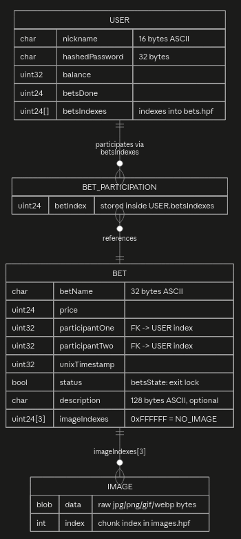

# бэкенд для "аукциона"

## Функционал
- Поддержка создания лотов
- Торги с повышением цены
- Запись базы данных на диск из ОЗУ
- Увеличение баланса пользователя
- Продажа лотов с отображением в "личном кабинете"
- <!-- NEW --> Загрузка и отдача картинок лотов (PNG / JPEG / GIF / WebP)

## Особенности

### База данных
База данных на основе формата хранения скриптов и ассетов из игры [Drag-on Dragoon, PlayStation 2, SQUARE ENIX(c)](https://en.wikipedia.org/wiki/Drakengard_(video_game)), обладает высокой скоростью работы и простотой формата.
Состоит из заголовка с версией формата и именем оного, таблицей оффсетов в uint32, и собственно самими данными по этим оффсетам. Внутри оффсетов лежат данные вида структуры

```
struct Bet {
    string betName;
    uint price;
    uint participantOne;
    uint participantTwo;
    uint unixTimestamp;
    bool status;
}

struct User {
    string nickname;
    string hashedPassword;
    uint balance;
    uint betsDone;
    uint[] betsIndexes;
}
```
в формате:

каждый лот занимает 32 байта под имя, цену в 3 байта, участников в 8 байт(два uint32), UNIX Timestamp в uint32(до 2106 года), и 1 байт под состояние true/false

и каждый юзер 16 байт под имя в ASCII, 32 байта под пароль, 4 байта под баланс, 3 байта под количество ставок, а также количество ставок в 3 байта

<!-- NEW -->
### Картинки лотов

Картинки хранятся **отдельным HPF-архивом** `data/db/images.hpf` и загружаются в RAM как `ubyte[][] images`. Каждый элемент массива — сырые байты одного файла (PNG / JPEG / GIF / WebP).

- **Индекс картинки** = индекс чанка в `images.hpf` = индекс в массиве `images`.
- В структуре `Bet` под картинки отведено **3 слота** (`uint[3] imageIndexes`, по 3 байта каждый, всего 9 байт в чанке).
- Магическое значение `NO_IMAGE = 0xFFFFFF` означает «в этом слоте картинки нет».
- Загрузка: `POST /imageUpload` с JSON `{ "data": "<base64>" }`. Ответ — индекс новой картинки в виде строки.
- Отдача: `GET /imageInfo?id=<index>`. MIME определяется по «магическим байтам» файла (`detectImageMime`), отдаётся сырой поток.

Поддерживаемые форматы и сигнатуры:

| Формат | Сигнатура | MIME |
|---|---|---|
| PNG  | `89 50 4E 47` | `image/png` |
| JPEG | `FF D8 FF` | `image/jpeg` |
| GIF  | `47 49 46` | `image/gif` |
| WebP | `52 49 46 46 ... 57 45 42 50` | `image/webp` |
| иное | — | `application/octet-stream` |

<!-- /NEW -->

### Структура кода

Использует процедурный подход, близкий к DOD, т.е все основано на массивах, структурах и индексах в массивах.

## Роли

### Пользователь
Покупает вещи, повышает цену на аукционе, тратит деньги

### Продавец
Продает вещи, задает начальную цену на аукционе, получает деньги

### Админ
Накручивает всем баланс, меняет состояния аукционов, сам выбирает уйдут ли деньги и заработает ли человек

## Пользовательские сценарии

### Регистрация

**Кратное описание**: Пользователь может зарегистрироваться.

**Сценарий**:

1. Пользователь открывает страницу сервиса, переходит на вкладку регистрации.
2. Вводит желаемый ник, пароль.
3. Отправляет форму.
4. Система создаёт запись структуры ```User``` и добавляет этот новый элемент в массив ```users```.
5. Пользователь перенаправляется на главную страницу.

### Создание товара продавцом

**Краткое описание**: Продавец может создать карточку нового товара.

**Сценарий**:

1. Продавец открывает главную страницу.
2. Нажимает кнопку "Создать лот".
3. Заполняет поля: название, цена.
<!-- NEW -->
4. При необходимости прикрепляет до трёх картинок (загружаются через `POST /imageUpload`, в лот попадают их индексы).
<!-- /NEW -->
5. Отправляет форму через кнопку "Выставить".
6. Система создаёт запись структуры ```Bet``` и добавляет этот новый элемент в массив ```bets```.
7. Товар отображается в списке "Лоты", т.е общий список товаров на продаже

### Оформление заказа покупателем

**Краткое описание**: Покупатель может начать торг на аукционе с продавцом.

**Сценарий**:

1. Покупатель открывает каталог товаров.
2. Выбирает понравившийся товар, жмет "Ставка".
3. Переходит в меню с установлением своей цены, нажимает "Сделать ставку".
5. Подтверждает повышение цены.
6. Система: 
    - Подтверждает, что ставка пользователя выше прошлой;
	- Ставит пользователя как первого в списке на покупку; 
	- Добавляет в поле betsIndexes в массиве users типа структуры User нужного индекса;
	- Ставит в bets структуры Bet значение второго участника торгов как пользователя;
	- Сохраняет все значения и меняет выводимые данные бэкендом.
7. Покупатель видит, что торги продолжаются, и теперь продавец может их остановить и продать товар ему.

<!-- NEW -->
### Просмотр картинок лота

**Краткое описание**: Любой клиент может получить картинку лота по её индексу.

**Сценарий**:

1. Клиент получает карточку лота (`GET /betInfo?id=N`), в поле `images` приходит массив из трёх индексов.
2. Для каждого индекса, не равного `0xFFFFFF`, клиент запрашивает `GET /imageInfo?id=<index>`.
3. Сервер отдаёт сырые байты с корректным `Content-Type` (`image/png`, `image/jpeg`, `image/gif`, `image/webp`).
4. Если индекс указывает на несуществующую картинку — сервер возвращает `404 not found`.
<!-- /NEW -->

## Функциональные требования

### Регистрация и авторизация

#### FR-AUTH-01

Система должна позволять гостю зарегистрировать учётную запись по нику и паролю.

#### FR-AUTH-02

Система должна позволять пользователю авторизоваться по нику и паролю.

#### FR-AUTH-03

Система должна возвращать идентификатор пользователя при успешной авторизации.

#### FR-AUTH-04

Система должна возвращать текстовую ошибку `error_no_user`, если пользователь с указанным ником не найден.

#### FR-AUTH-05

Система должна возвращать текстовую ошибку `error_incorrect_pwd`, если пароль не совпадает.

#### FR-AUTH-06

Система должна позволять пользователю выйти из учётной записи на стороне клиента.

### Лоты и торги

#### FR-LOT-01

Система должна позволять продавцу создавать новый лот с названием и начальной ценой.

#### FR-LOT-02

Система должна запрещать создание лота с ценой выше баланса продавца.

#### FR-LOT-03

Система должна отображать список лотов в заданном диапазоне ID.

#### FR-LOT-04

Система должна отображать карточку лота: название, цену, продавца, текущего лидера, статус и UNIX-время создания.

<!-- NEW -->
#### FR-LOT-04a

Система должна отображать в карточке лота до трёх индексов картинок (`imageIndexes`), где `0xFFFFFF` означает отсутствие картинки в слоте.
<!-- /NEW -->

#### FR-LOT-05

Система должна поддерживать два статуса лота: `торги идут` и `торги закрыты`.

#### FR-LOT-06

Система должна запрещать покупателю делать ставку ниже текущей цены лота.

#### FR-LOT-07

Система должна запрещать покупателю делать ставку, если его баланс ниже текущей цены лота.

#### FR-LOT-08

Система должна назначать сделавшего ставку покупателя текущим лидером лота (`participantTwo`).

#### FR-LOT-09

Система должна добавлять индекс лота в список `betsIndexes` покупателя, если его там ещё нет.

#### FR-LOT-10

Система должна позволять покупателю отозвать свою ставку, если торги не закрыты и он не является продавцом.

#### FR-LOT-11

Система должна обнулять `participantTwo` при отзыве ставки.

#### FR-LOT-12

Система должна запрещать продавцу отзывать ставку на собственный лот.

#### FR-LOT-13

Система должна запрещать отзыв ставки после закрытия торгов.

<!-- NEW -->
### Картинки

#### FR-IMG-01

Система должна принимать картинку в base64 через `POST /imageUpload` и возвращать её индекс в виде строки.

#### FR-IMG-02

Система должна возвращать `error_no_data`, если в теле запроса нет поля `data`.

#### FR-IMG-03

Система должна возвращать `error_bad_base64`, если base64 некорректен.

#### FR-IMG-04

Система должна возвращать `error_empty_image`, если после декодирования получился пустой массив байт.

#### FR-IMG-05

Система должна отдавать сырые байты картинки по `GET /imageInfo?id=<index>`.

#### FR-IMG-06

Система должна определять MIME-тип картинки по сигнатуре файла (PNG / JPEG / GIF / WebP) и отдавать его в `Content-Type`.

#### FR-IMG-07

Система должна возвращать `404 not found`, если запрошен несуществующий индекс картинки.

#### FR-IMG-08

Система должна поддерживать не более трёх картинок на один лот (`Bet.imageIndexes[3]`).

#### FR-IMG-09

Система должна сохранять картинки в `data/db/images.hpf` при вызове `/flush`.
<!-- /NEW -->

### Управление лотами со стороны продавца

#### FR-SELL-01

Система должна позволять продавцу удалять собственный лот.

#### FR-SELL-02

Система должна запрещать удаление лота пользователем, не являющимся его продавцом (ошибка `error_not_creator`).

#### FR-SELL-03

Система должна позволять продавцу закрыть торги по лоту.

#### FR-SELL-04

Система должна возвращать `success` при повторном закрытии уже закрытых торгов.

#### FR-SELL-05

Система должна позволять продавцу подтвердить продажу лота, переводя `status` в `true` и начисляя цену лота продавцу.

#### FR-SELL-06

Система должна запрещать продажу лота без покупателя (ошибка `error_no_participant_two`).

#### FR-SELL-07

Система должна запрещать повторную продажу лота (ошибка `error_already_settled`).

### Профиль пользователя

#### FR-USER-01

Система должна отображать профиль пользователя: ID, ник, баланс, количество сделок.

#### FR-USER-02

Система должна отображать список лотов пользователя, разделённый на активные, проданные и купленные.

#### FR-USER-03

Система должна позволять пользователю изменять свой баланс.

#### FR-USER-04

Система должна возвращать `error_no_user`, если запрошен несуществующий пользователь.

#### FR-USER-05

Система должна возвращать `error_no_bet`, если запрошен несуществующий лот.

### Формат вывода

#### FR-FMT-01

Система должна поддерживать вывод данных в форматах Lua и JSON.

#### FR-FMT-02

Система должна выбирать формат по query-параметру `format` (по умолчанию — Lua).

#### FR-FMT-03

Система должна устанавливать корректный `Content-Type` (`text/x-lua` или `application/json`).

#### FR-FMT-04

Система должна экранировать спецсимволы строк при выводе в обоих форматах.

### Администрирование

#### FR-ADMIN-01

Система должна позволять администратору делать ставку от имени произвольного пользователя.

#### FR-ADMIN-02

Система должна позволять администратору отзывать ставку произвольного пользователя.

#### FR-ADMIN-03

Система должна позволять администратору закрывать торги по произвольному лоту.

#### FR-ADMIN-04

Система должна позволять администратору подтверждать или отклонять продажу лота.

#### FR-ADMIN-05

Система должна позволять администратору удалять произвольный лот.

#### FR-ADMIN-06

Система должна позволять администратору изменять баланс произвольного пользователя.

#### FR-ADMIN-07

Система должна позволять администратору сохранять все данные на диск и перезагружать их в RAM.

#### FR-ADMIN-08

Система должна позволять администратору просматривать профиль произвольного пользователя.

<!-- NEW -->
#### FR-ADMIN-09

Система должна позволять администратору удалять произвольную картинку (при наличии соответствующего эндпоинта).
<!-- /NEW -->

### Работа с данными

#### FR-DB-01

Система должна загружать пользователей и лоты из HPF-архивов в RAM при старте.

#### FR-DB-02

Система должна сохранять пользователей и лоты из RAM в HPF-архивы по команде администратора.

#### FR-DB-03

Система должна после сохранения перезагружать данные из архивов в RAM.

#### FR-DB-04

Система должна продолжать работу при ошибке записи, возвращая HTTP 500 и текст ошибки в теле ответа.

<!-- NEW -->
#### FR-DB-05

Система должна загружать картинки из `data/db/images.hpf` в RAM при старте и сохранять их обратно при вызове `/flush`.

#### FR-DB-06

Система должна использовать три независимых HPF-архива: `users.hpf`, `bets.hpf`, `images.hpf`.
<!-- /NEW -->

## Нефункциональные требования

### Производительность

#### NFR-PERF-01

Создание лота должно завершаться не более чем за 1 секунду.

#### NFR-PERF-02

Список лотов должен отдаваться постранично через диапазон ID (`filter-from` / `filter-to`), не более 50 записей за раз.

#### NFR-PERF-03

Сохранение данных на диск (`/flush`) должно выполняться без потери данных при успешном завершении.

#### NFR-PERF-04

Система должна работать на одном узле без внешней СУБД.

<!-- NEW -->
#### NFR-PERF-05

Отдача картинки (`/imageInfo`) должна выполняться без промежуточного декодирования — сырые байты из RAM.

#### NFR-PERF-06

Размер одной картинки ограничен разумными рамками (рекомендуется ≤ 5 МБ), так как все картинки держатся в RAM.
<!-- /NEW -->

### Надёжность

#### NFR-REL-01

Система должна возвращать HTTP 200 при успешных операциях и HTTP 404 при запросе несуществующего пользователя или лота.

#### NFR-REL-02

Система должна возвращать текстовые коды ошибок, начинающиеся с `error_`, для неуспешных операций.

#### NFR-REL-03

Система должна перезаписывать HPF-архив атомарно (через временный файл и копирование).

<!-- NEW -->
#### NFR-REL-04

Система должна возвращать HTTP 404 при запросе несуществующей картинки.
<!-- /NEW -->

### Совместимость

#### NFR-COMP-01

Система должна собираться компилятором LDC версии 1.43.0 и выше.

#### NFR-COMP-02

Система должна работать с фронтендом, использующим Materialize CSS 1.0.0 и Fetch API.

#### NFR-COMP-03

Система должна поддерживать вывод в форматах Lua и JSON для совместимости с разными клиентами.

<!-- NEW -->
#### NFR-COMP-04

Система должна поддерживать картинки форматов PNG, JPEG, GIF и WebP.
<!-- /NEW -->

### Безопасность

#### NFR-SEC-01

Система не должна хранить пароли в открытом виде — только их хеши.

#### NFR-SEC-02

Система должна проверять принадлежность лота продавцу перед операциями удаления и продажи.

#### NFR-SEC-03

Система должна проверять баланс покупателя перед принятием ставки.

<!-- NEW -->
#### NFR-SEC-04

Система должна ограничивать размер принимаемой base64-картинки, чтобы избежать исчерпания RAM.
<!-- /NEW -->

## Сборка

Скачать компилятор [Dlang](https://github.com/ldc-developers/ldc/releases/tag/v1.43.0), в папке проекта запустить

```
dub build --build=release
```

и далее к [Запуску](#запуск)

## Запуск
Выдает help по умолчанию, но синтаксис такой:

```
./backend [папка_где_есть_подпапка_data c базой данных и папкой assets с index.html] [локальный адрес] [порт]
```

## Как создать базу данных
Есть папка utils, там два python скрипта - bet_gen.py и user_gen.py

каждый запускается без аргументов и выдает bet.hpf и user.hpf соответственно, и они кладутся в data/db/

<!-- NEW -->
Картинки в `data/db/images.hpf` создаются автоматически при первом `/flush` (или могут быть сгенерированы отдельным скриптом-заглушкой).
<!-- /NEW -->

## Как получить доступ к фронтенду
http://[указанный адрес]:[port]/ - он там и будет, взятый из папки в первом аргументе

## Использованный стек
[Vibe-D - фреймворк для Dlang для создания веб-серверов](https://vibed.org/)

[Himmel Engine для Himmel Package Format в качестве базы данных](https://underlevel.su/git/quantumde1/himmel_engine/src/3d-dev/source/system/hpf.d)

## ER диаграмма

<!-- UPD -->
Она не будет корректна в классическом смысле: в движке нет сущностей (entity) и связей (relations) как в реляционной СУБД. Все «связи» — это просто `uint`-индексы в массивах `users[]`, `bets[]`, `images[]`, а роль PK играет **позиция элемента в массиве**, а не отдельное поле в HPF-чанке. Поэтому диаграмма ниже — это **логическая модель** (какие данные с какими связаны), а не физическая схема хранилища.



### Что показывает диаграмма

Три сущности и их поля:

- **USER** — `index` (PK, неявный), `nickname`, `hashedPassword`, `balance`, `betsDone`.
- **BET** — `index` (PK, неявный), `betName`, `price`, `participantOne` (FK → USER), `participantTwo` (FK → USER, `0` = нет), `unixTimestamp`, `status`, `description`, а также `imageIndexes[3]` (FK → IMAGE, `0xFFFFFF` = нет).
- **IMAGE** — `index` (PK, неявный), `data` (сырые байты).

Связи:

| Связь | Кардинальность | Смысл |
|---|---|---|
| `USER \|\|--o{ BET` (`betsIndexes[]`) | 1 : N | у пользователя есть список индексов его лотов |
| `USER \|\|--o{ BET` (`participantOne`) | 1 : N | у каждого лота ровно один создатель (обязателен) |
| `USER \|o--o{ BET` (`participantTwo`) | 0..1 : N | второй участник может отсутствовать (`0` = нет) |
| `BET }o--o{ IMAGE` (`imageIndexes[3]`) | 0..N : 0..N | у лота до 3 картинок, `0xFFFFFF` = нет |

### Чего на диаграмме нет

- **Массивности**: `betsIndexes` — это массив, `imageIndexes` — массив из 3 элементов. Mermaid рисует их как обычные FK.
- **Магических значений**: `participantTwo = 0` и `imageIndexes[i] = 0xFFFFFF`. Показаны только подписями.
- **`betsState[]`** — параллельного массива, используемого рантаймом для контроля отзыва ставок.
- **Дублирования**: `User.betsIndexes` дублирует `Bet.participantOne/Two`, а `User.betsDone` дублирует `User.betsIndexes.length`. Это осознанное решение ради скорости (DOD-подход).
- **Физической раскладки** HPF-чанков (смещения байтов, длины строк). Для этого нужна отдельная диаграмма «HPF layout».

### Как читать обозначения

| Символ | Значение |
|---|---|
| `\|\|` | ровно один (обязательно) |
| `\|o` | ноль или один (опционально) |
| `o{` / `}o` | ноль или много |
| `\|{` / `}\|` | один или много |
| `PK` | первичный ключ (в нашей модели — неявный индекс в массиве) |
| `FK` | внешний ключ (индекс в другом массиве) |
<!-- /UPD -->